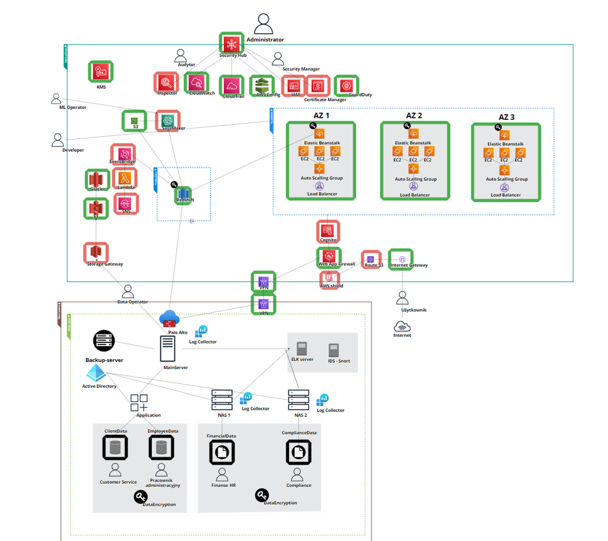

# hybrid-cloud-project

## Project Overview
The aim of the project was to create and implement a secure, scalable hybrid cloud for a medium-sized national courier company. The main motto of the cloud being developed was "As safe as possible, regardless of the cost". Thanks to this, the project focused on creating an effective data storage and processing system, as well as optimizing the company's business processes, using the latest AWS technologies and tools to ensure the highest level of data security.

## Public Cloud
- **Functionality**: Provides scalable, secure, always available solutions allowing for user changes to the delivery address/delivery date via a web application (Beanstalk with automatically set Load Balancer and Auto Scaling Group in multi-availability zones), sending notifications when the package status changes achievable through the use of services such as: EventBridge, Lambda, AWS SNS. Enables the company to apply ML to optimize package distribution processes by analyzing data from the main database server and the Amazon Sagemaker service. The public cloud infrastructure will also allow the organization to automatically back up data in the public cloud, as well as backups of sensitive data containing personal information after its previous encryption and transfer via Storage Gateway to S3 where, in accordance with the data lifecycle, they will be moved to Amazon Glacier for archiving after a year.

## Private Cloud
- **Functionality**: Allows access and modification of sensitive data such as customer data, employee personal data, employment information, time reports, salaries, audits and reporting, privacy policies contained in databases and file servers. This data is also backed up in the private cloud. Logs are analyzed both by the ELK server and the IDS system in the form of Snort.Users in this cloud have local accounts and Active Directory acts as the AAA server.

## Brief description of the operation of services in the public cloud

Starting from the user's perspective, they can use an application that allows them to change the delivery point of the package, delivery date, etc. Their request first passes through the AWS Shield service positioned before WAF. AWS Shield is the first line of defense against DDoS attacks. If a DDoS attack is detected, AWS Shield can block it at the network level before it reaches the WAF. This protects against DDoS and saves unnecessary actions on the part of the WAF. The domain itself is provided by the Route53 service. The next element is Cognito, allowing, for example, a user with elevated privileges, such as a web application administrator, to log into elements inaccessible to a regular user, who doesn't need an account to use the basic functionality of the service. The subsequent service is Elastic Beanstalk, which in the proper configuration provides a default load balancer with auto-scaling in multiple AZs. Beanstalk communicates in an encrypted manner with Redshift, which serves as a data warehouse storing information about packages, delivery routes, etc. These data are either sent directly to Sagemaker or using an S3 bucket to ensure buffering. Data sent to Sagemaker can be used to create ML models optimizing, for example, delivery routes, etc. Redshift also has access to the EventBridge service, which reacts to changes in a specific table, more precisely, changes in a column indicating a change in the package delivery status. EventBridge triggers AWS Lambda, which, according to the written script, invokes the Simple Notification Service, sending the user information, for example, in the form of an SMS, that their package has been delivered/is ready for collection. The next element present in the public cloud is a stack of services responsible for data storage. In the case of the public cloud, it enables the archiving and backup process of data originating from the public cloud. The utilized Storage Gateway provides the ability to transfer data from on-premise resources and, through data lifecycle settings, sends data after a specified time to services providing cheaper storage, using the fact that access to them might be less frequent. Security groups limit the traffic to the absolute minimum. In the public cloud, the role of a sort of event aggregator related to security is played by the Security Hub. Here, you can find grouped information from other services responsible for cloud security, such as CloudTrail, which is responsible for registration and monitoring of all events related to the account and resources in the cloud, or Amazon GuardDuty, a threat detection service that continuously monitors potential threats and suspicious activities in the AWS environment.

## Data Categorization
### Private Cloud
- **Customer data**: such as name, address, email address, phone number - database in the private cloud `ClientData`.
- **Personnel data**: such as employee personal data, employment information, time reports, salaries, etc. - database in the private cloud `EmployeeData`.
- **Compliance data**: such as certification data, compliance with regulations, audits and reporting, privacy policies, etc. - file server in the private cloud.
- **Financial data**: tax documents, financial reports, employee tax documents, and salary data - file server in the private cloud.

### Public Cloud
- **Payment data**: data related to payments and settlements with customers and suppliers - stored as logs, etc. - stored in Redshift/RDS.
- **Archival data (older than a year)**: required to be stored for a specified time: tax documents, financial reports - stored in S3 and then in Glacier.
- **Shipment data**: such as type of shipment, weight, dimensions, place of dispatch and receipt, date and time of dispatch and receipt, parcel number, parcel value, information on the contents of the parcel, delivery preferences, etc. - stored in Redshift/RDS.
- **Logistics data**: such as delivery route information, delivery time, parcel tracking, storage data, inventory management, etc. - stored in Redshift/RDS.

## IAM in the Public Cloud
In the public cloud, we can identify the following actors mapped by IAM:
- **User**: Has access to the web application. Negligible in infrastructure context because he doesn't have an account.
- **Developer**: Access to manage public cloud resources related to the web application - Beanstalk, Redshift/RDS, SNS.
- **ML Operator**: Permission provides access to manage services for data processing and analysis for ML purposes: Sagemaker, Redshift/RDS.
- **Data Operator**: Permission provides access to manage Storage Gateway, data lifecycle, S3.
- **Security Manager**: Permissions related to security management and securing hybrid cloud infrastructure; manages services connected to AWS Security Hub and also services like VPN, KMS, Web App Firewall.
- **Auditor**: An external party with read-only access to services related to security such as: CloudWatch, CloudTrail, AWS Config, Inspector.
- **Administrator**: Manages the entire AWS account. Each of the mentioned user accounts will be obliged to use MFA.

## Users/Groups in the Private Cloud
In the private cloud, we can identify the following users/groups with given permissions:
- **Customer Service**: Low level of permissions, has access to write, read, create backups, and modify data from the `ClientData` database in the private cloud.
- **Administrative Employee**: Low level of permissions, has access to write, read, create backups, and modify data from the `EmployeeData` database in the private cloud.
- **Finance_HR**: Access to write, read, create backups, and modify data from the `FinancialData` file server.
- **Compliance**: Access to write, read, create backups, and modify data from the `ComplianceData` file server.

## Service Limitations
Unfortunately, due to student account limitations in the AWS service, I was unable to recreate most of the designed infrastructure.

| Successfully implemented | Unable to implement due to student account limitations |
|--------------------------|-------------------------------------------------------|
| S3                       | Inspector                                              |
| Glacier                  | IAM                                                    |
| KMS                      | EventBridge                                            |
| CloudWatch               | Lambda                                                 |
| Security Hub             | SNS                                                    |
| CloudTrail               | AWS Shield                                             |
| AWS Config               | Route 53                                               |
| Elastic Beanstalk        | Storage Gateway                                        |
| EC2                      | SageMaker                                              |
| Auto Scaling Group       | Certificate Manager                                    |
| Load Balancer            |                                                        |
| WAF                      |                                                        |
| Internet Gateway         |                                                        |

